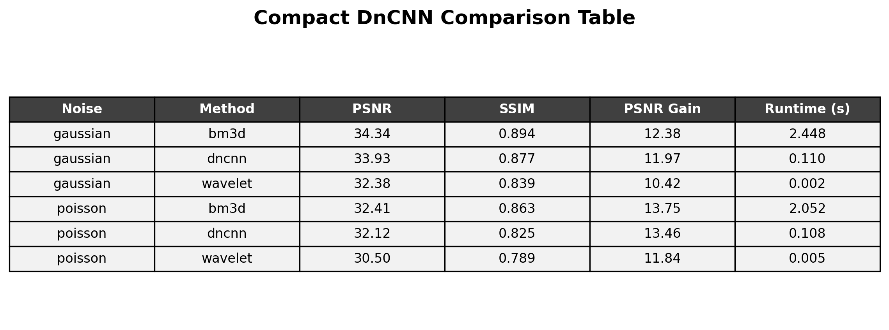
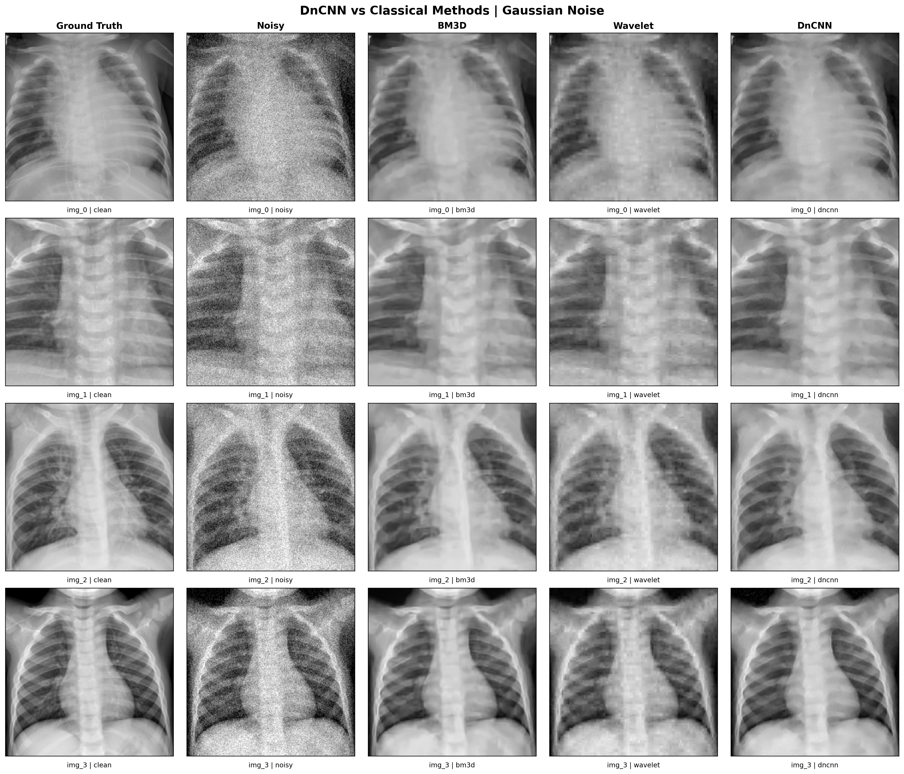
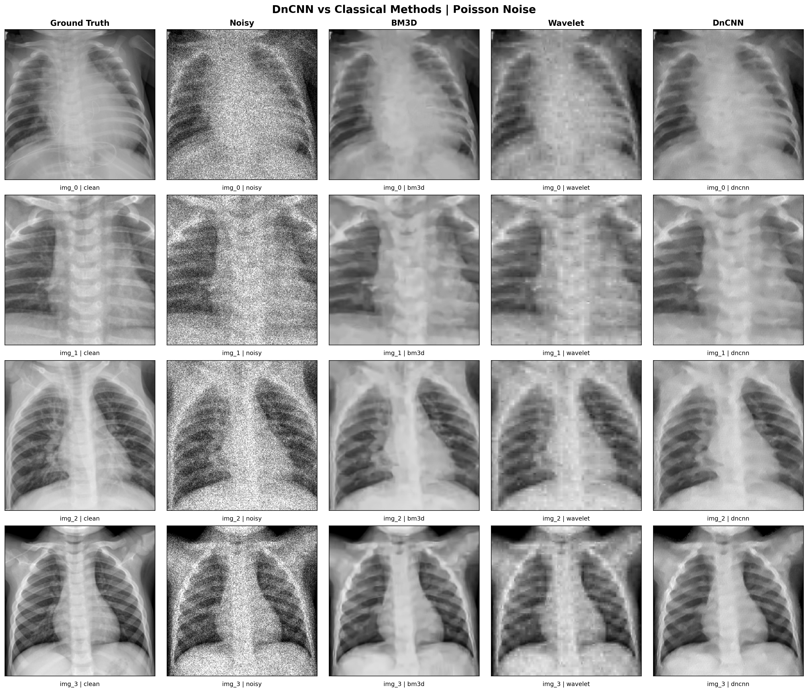

# X-Ray Image Denoising Pipeline with Classical Methods and DnCNN

A modular Python/PyTorch project for evaluating image denoising methods on chest X-ray images.

## Overview

This project compares classical denoising methods and a deep learning denoiser (DnCNN) on the PneumoniaMNIST chest X-ray dataset.

### Included methods
- BM3D
- Wavelet denoising
- DnCNN

### Noise models
- Gaussian noise
- Poisson noise

### Evaluation metrics
- MSE
- MAE
- NRMSE
- PSNR
- SSIM
- Runtime per image

The project supports:
- reproducible noise generation using a fixed random seed
- fair comparison under the same dataset, same noise settings, and same test split
- train / validation / test workflow for DnCNN
- CSV summaries and visual plots

---

## Dataset

This repository uses **PneumoniaMNIST**.

Important notes:
- The original dataset contains grayscale chest X-ray images
- The source images are single-channel
- For the classical branch, grayscale and RGB processing can both be tested
- In the RGB case, the grayscale image is repeated into 3 channels
- For DnCNN, grayscale training is the most meaningful setting because the source dataset is grayscale

### Default settings
- Image size: 224 × 224
- Train split: used for DnCNN training
- Validation split: used for model selection
- Test split: used for final comparison against classical methods

---

## Fair Comparison Design

All methods are compared under the same conditions:
- same dataset
- same image size
- same test split
- same Gaussian noise settings
- same Poisson noise settings
- same random seed

---

## Main Result



---

## Example Visual Results

### Gaussian noise


### Poisson noise


---

## Project Structure

```text
image-denoising-pipeline/
│
├── checkpoints/
├── docs/
│   └── figures/
├── src/
│   ├── config.py
│   ├── dataset_loader.py
│   ├── image_utils.py
│   ├── noise.py
│   ├── denoise.py
│   ├── metrics.py
│   ├── visualization.py
│   ├── main.py
│   ├── dncnn_model.py
│   ├── train_dncnn.py
│   ├── compare_dncnn.py
│   └── plot_compare_dncnn.py
│
├── .gitignore
├── LICENSE
├── README.md
└── requirements.txt