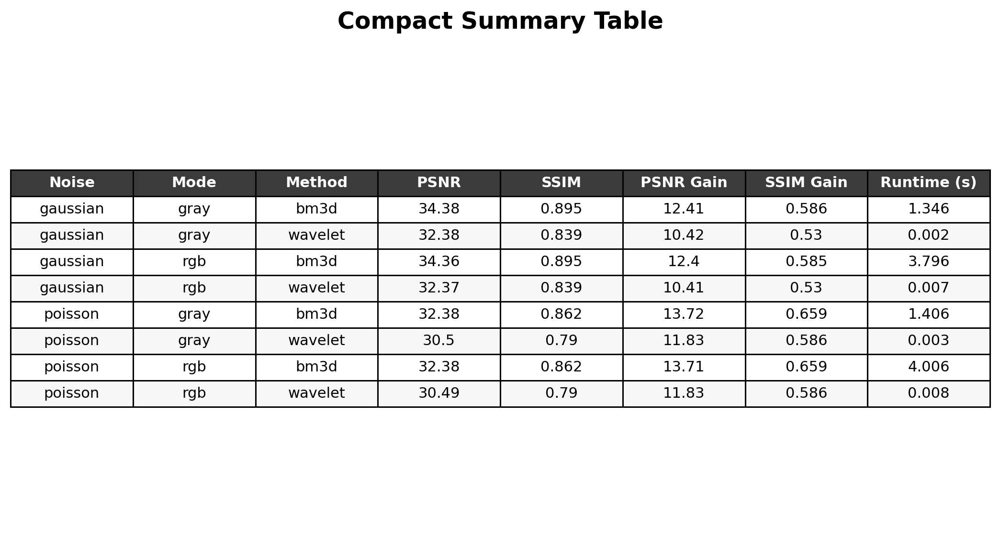

# X-Ray Image Denoising Pipeline with PyTorch

A modular Python/PyTorch project for evaluating classical denoising methods on chest X-ray images.

## Overview

This project builds a complete denoising workflow for X-ray images using:

- **Dataset:** PneumoniaMNIST
- **Noise models:** Gaussian and Poisson
- **Denoising methods:** BM3D and Wavelet denoising
- **Evaluation metrics:** MSE, MAE, NRMSE, PSNR, and SSIM
- **Extra analysis:** runtime per image and RGB vs grayscale comparison

The project automatically downloads the dataset, applies controlled noise, performs denoising, computes quantitative metrics, and saves figures and CSV summaries.

---

## Main Features

- Automatic dataset download with MedMNIST
- Reproducible experiments using a fixed random seed
- Separate Gaussian and Poisson experiments
- Comparison of:
  - noisy vs denoised
  - BM3D vs Wavelet
  - RGB vs grayscale
- Metric summary tables
- Runtime tracking
- Visualization of results

---

## Dataset

This repository uses **PneumoniaMNIST**.

Important notes:

- The original dataset contains **grayscale chest X-ray images**.
- The **gray branch** uses the image in its original single-channel form.
- The **RGB branch** is created by repeating the same grayscale image into 3 channels.
- This provides a **controlled RGB-vs-gray comparison** without changing the original image content.

Default experiment settings:

- **Image size:** 224 × 224
- **Split:** test
- **Number of images:** 40

We use the **test split** because this project evaluates denoising performance and does not train a deep learning model.

---

## Methods

### Noise models
- Gaussian noise
- Poisson noise

### Denoising methods
- BM3D
- Wavelet denoising

### Metrics
- MSE
- MAE
- NRMSE
- PSNR
- SSIM
- Runtime per image

---

## Compact Result Summary



---

## Project Structure

```text
image-denoising-pipeline/
│
├── docs/
│   └── figures/
├── src/
│   ├── config.py
│   ├── dataset_loader.py
│   ├── image_utils.py
│   ├── noise.py
│   ├── denoise.py
│   ├── metrics.py
│   ├── visualization.py
│   └── main.py
│
├── .gitignore
├── LICENSE
├── README.md
└── requirements.txt